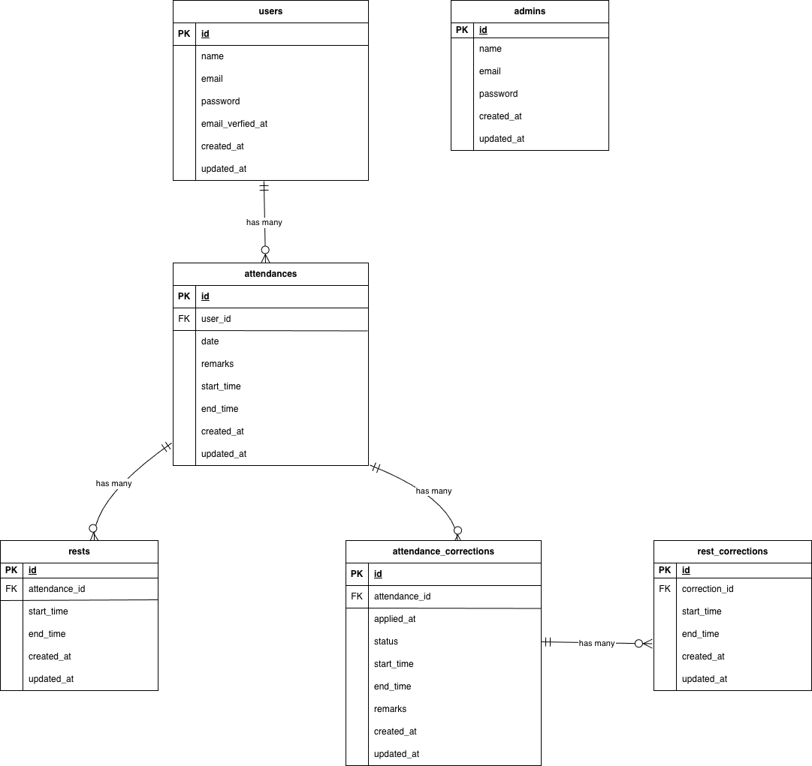

# 模擬案件\_勤怠管理アプリ

模擬案件\_勤怠管理アプリ（Laravel 8 + MySQL）。
勤怠登録、修正申請、CSV エクスポートを実装しています。

## 環境構築

**Docker ビルド**

1. `git clone git@github.com:komanoakari/Practice-Project2.git`
2. cd Practice-Project1
3. DockerDesktop アプリを立ち上げる
4. `docker compose up -d --build`

**Laravel 環境構築**

> `.env` は `./src/.env` に置きます。

1. `docker compose exec php bash`
2. `cd src`
3. `composer install`
4. 「.env.example」を「.env」にコピー
   `cp .env.example .env`

5. .env に以下の環境変数を追加

```text
APP_URL=http://localhost:8018

DB_CONNECTION=mysql
DB_HOST=mysql
DB_PORT=3306
DB_DATABASE=laravel_db
DB_USERNAME=laravel_user
DB_PASSWORD=laravel_pass

# MailHog
MAIL_MAILER=smtp
MAIL_HOST=mailhog
MAIL_PORT=1025
MAIL_ENCRYPTION=null
MAIL_FROM_ADDRESS=noreply@example.test
MAIL_FROM_NAME="${APP_NAME}"
```

6. アプリケーションキーの作成

```bash
php artisan key:generate
php artisan config:clear
```

7. マイグレーション & 初期データ投入

```bash
php artisan migrate --seed

```

## 使用技術(実行環境)

- PHP: 8.1.33
- Laravel: 8.83.29
- Nginx: 1.21.1
- MySQL: 8.0.26
- phpMyAdmin
- MailHog
- Docker Desktop（Compose v2）
- Git

## URL

- 開発環境: http://localhost:8018/
- phpMyAdmin: http://localhost:8019/（Server は `mysql`）
- MailHog（受信 BOX）: http://localhost:8025/（SMTP は `mailhog:1025`）

## phpMyAdmin ログイン

- URL: http://localhost:8019/
- Server: mysql
- Username: laravel_user
- Password: laravel_pass

## PHPUnit テストケース

> 起動

```bash
docker compose up -d
```

> テスト環境の.env 作成+鍵発行

```bash
cp src/.env.testing.example src/.env.testing
docker compose exec php bash -lc 'cd src && php artisan key:generate --env=testing'
```

> テスト DB を作成

```bash
docker compose exec mysql mysql -uroot -p
```

-- 以下、MySQL プロンプト内で

```bash
CREATE DATABASE IF NOT EXISTS laravel_db_testing
CHARACTER SET utf8mb4 COLLATE utf8mb4_unicode_ci;
GRANT ALL PRIVILEGES ON `laravel_db_testing`.* TO 'laravel_user'@'%';
FLUSH PRIVILEGES;
EXIT;
```

> テスト実行

```bash
docker compose exec php bash -lc 'cd src && php artisan test'
```

## ログイン用テストアカウント（Seeder で作成済み）

- メール：test@example.com
- パスワード：password

## ER 図


